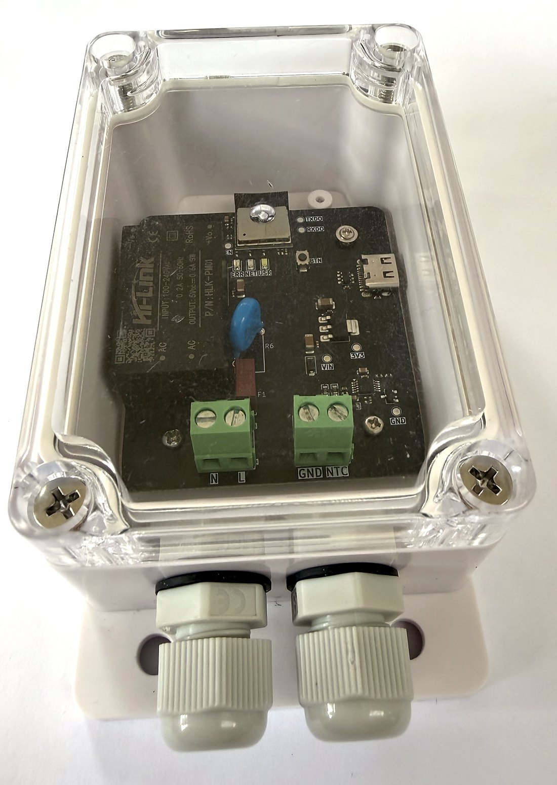

# GeyserSense

**A geyser water-temperature sensor for people who run Home Assistant or Node-RED.** It reads the probe in your geyser's thermostat and gives your automation the number, every 30 seconds. It also remembers the over-heating you were asleep for.

## Is it for me?

Three checks. If all three are yes, it is.

- Your geyser will get a **Geyserwise GEY013** stem thermostat in place of the one it has now. GeyserSense reads its probe.
- Your geyser is switched by **rules you control**: Home Assistant, Node-RED, or anything that can read a value and switch a load. Once the GEY013 is in, your rules alone decide the water temperature.
- There is **WiFi at the geyser**.

If you would rather your geyser regulate itself in hardware, this is the wrong product for you.

## What it does

- **Tells you how hot the water actually is.** ±0.5 °C over 39.95–76.20 °C, measured against a PT100 reference. Outside that range it still reports, and says on its own screen that the reading is approximate.
- **Remembers over-heating.** The hottest the water has been, when that happened, and how often it has gone over the limit you set. The record survives a power cut, and only you can clear it.
- **Talks to what you already run.** MQTT with Home Assistant Discovery, or read-only JSON over your LAN. No cloud, no account, no app to install.

## What it does not do

- It does not control the geyser. No relay, no setpoint.
- It does not detect a tripped cut-out. It reports the over-heating that usually precedes one.
- It does not make the geyser safer, and it does not promise a saving.

## Price and ordering

**R950 for the board.** Enclosure and GEY013 sold separately.

Email **karl@elektrohome.co.za** to order, or to ask a question first.

## Setting it up

Set it up on the kitchen table first. Then have it fitted.

1. Get it onto your WiFi, on the table, powered from USB-C.
2. Test the sensor, still on the table, with the resistor that came in the box.
3. Send the readings somewhere: Home Assistant, or any MQTT broker.
4. Have it installed at the geyser, by a plumber or an electrician.

The **[setup guide](geysersense-setup-guide.pdf)** walks each step with the unit's own screens. The **[flyer](geysersense-flyer.pdf)** is the one-page version of this page, for printing or forwarding.

## Keeping it up to date

New firmware is published under **[Releases](https://github.com/KarlOttoFuchs/GeyserSense/releases/latest)**. Download the `.bin` file, open the unit's page, go to Settings › Update, and choose the file. The unit names its current version and the one it is moving to before it starts. A bad image rolls back on its own.

## Safety

Mains wiring at the geyser is done by an electrician. The table test and WiFi setup are USB-C only, with the board out of its enclosure and never on mains.
